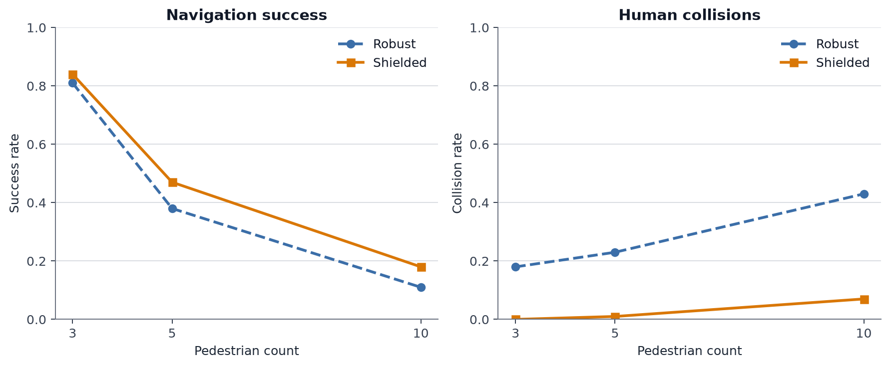
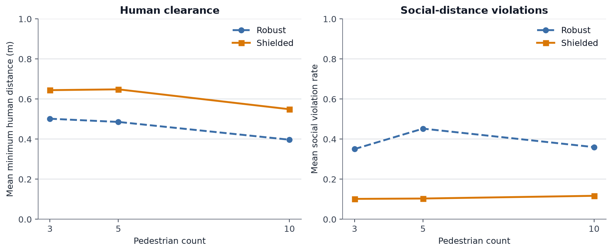
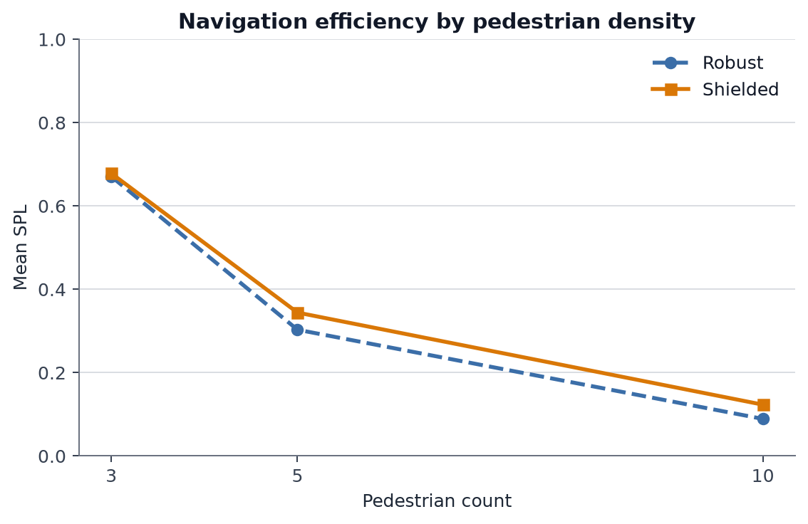
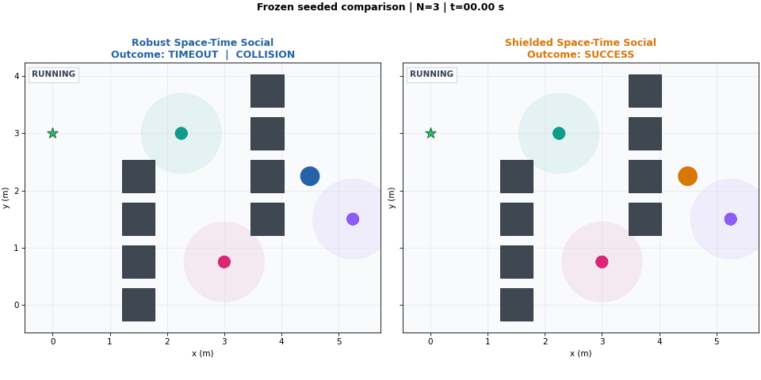
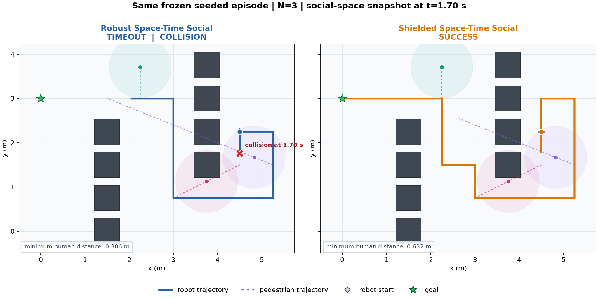

# SocialNav-Bench

A reproducible benchmark for socially-aware robot navigation in dynamic multi-pedestrian environments.

> **Status:** v1.0.0 release candidate

SocialNav-Bench studies how classical, social-aware, predictive, and space-time planners behave as pedestrian density increases. The project combines navigation algorithms, continuous execution, safety-aware local control, reproducible benchmarking, and systematic failure analysis.

## Highlights

- Reproducible dynamic pedestrian navigation benchmark
- Classical A* and reactive dynamic-avoidance baselines
- Social-aware and predictive social planning
- Space-Time Social A* with explicit MOVE / WAIT reasoning
- Robust continuous execution with replanning and collision egress
- Predictive local safety shield for multi-human navigation
- Arbitrary multi-pedestrian scenarios
- Density benchmarks at 1 / 3 / 5 / 10 pedestrians
- Failure taxonomy, diagnostics, and social-weight ablations
- 491 automated tests

## Benchmark Snapshot

100 diverse episodes per density, seed 42.

| Pedestrians | Method | Success | Collision | SPL | Min Human Distance | Social Violation |
|---:|---|---:|---:|---:|---:|---:|
| 3 | Robust Space-Time | 81% | 18% | 0.671 | 0.502 | 0.351 |
| 3 | **Shielded Space-Time** | **84%** | **0%** | **0.678** | **0.644** | **0.102** |
| 5 | Robust Space-Time | 38% | 23% | 0.303 | 0.486 | 0.452 |
| 5 | **Shielded Space-Time** | **47%** | **1%** | **0.344** | **0.648** | **0.104** |
| 10 | Robust Space-Time | 11% | 43% | 0.089 | 0.397 | 0.360 |
| 10 | **Shielded Space-Time** | **18%** | **7%** | **0.123** | **0.549** | **0.117** |

The predictive local safety shield substantially reduces collisions in dense multi-pedestrian scenarios while preserving the underlying robust space-time planner.

## Benchmark Trends

The figures below are generated directly from the frozen 100-episode, seed-42 density benchmark.







Shielded execution sharply reduces collision rate at every tested density. The success-rate improvements are more modest, and the N=10 scenarios remain challenging; these results do not imply that dense-crowd navigation is solved.

Reproduce the headline comparison and regenerate the figures from repository
commands alone with:

```bash
python experiments/run_density_benchmark.py \
  --episodes 100 \
  --seed 42 \
  --pedestrians 3,5,10 \
  --methods social_spacetime_robust,social_spacetime_shielded \
  --output outputs/reproduced_shield_density_benchmark_seed42.json
python experiments/plot_benchmark_results.py \
  --input outputs/reproduced_shield_density_benchmark_seed42.json \
  --output-dir docs/assets
```

The generated JSON remains under the gitignored `outputs/` directory. The
published figures are tracked under `docs/assets/`.

## Demo

The same frozen seed-42, three-pedestrian episode is replayed below for Robust
and Shielded Space-Time Social. Robust collides and times out; Shielded avoids
the collision and reaches the goal without changing the scenario or initial
conditions.



[Watch the higher-quality MP4](docs/assets/socialnav_demo.mp4)



Reproduce both animations and the trajectory figure with:

```bash
python experiments/render_demo.py \
  --scenario-id diverse-seed-42-episode-0024-pedestrians-3
```

The renderer uses a system `ffmpeg` when available and otherwise uses the
`imageio-ffmpeg` binary installed by `requirements.txt`.

## Navigation Methods

The benchmark currently includes:

- `astar`
- `dynamic`
- `social`
- `social_replan`
- `social_replan_escape`
- `social_replan_recovery`
- `social_predictive`
- `social_predictive_replan`
- `social_spacetime`
- `social_spacetime_replan`
- `social_spacetime_robust`
- `social_spacetime_shielded`

The latest method combines robust space-time planning with predictive local MOVE / WAIT safety checks, deterministic physical overrides, and immediate post-override replanning.

## Evaluation Metrics

SocialNav-Bench evaluates navigation using:

- Success rate
- Collision rate
- Path length
- Time to goal
- SPL
- Minimum human distance
- Social violation rate

## Project Structure

```text
socialnav-bench/
├── socialnav/       # planners, simulation, benchmark and evaluation code
├── experiments/     # benchmark, ablation and failure-analysis scripts
├── tests/           # regression and behavior tests
├── outputs/         # generated experiment artifacts (gitignored)
├── requirements.txt # runtime, plotting and test dependencies
└── README.md
```

## Requirements and Installation

The project supports Python 3.10 or newer and was audited on Python 3.10 and
3.11. From the repository root, create and activate an isolated environment,
then install the tracked dependencies. With conda:

```bash
conda create --name socialnav python=3.10 -y
conda activate socialnav
python -m pip install -r requirements.txt
```

Or with the standard-library virtual environment module:

```bash
python3 -m venv .venv
source .venv/bin/activate
python -m pip install --upgrade pip
python -m pip install -r requirements.txt
```

On Debian or Ubuntu, install the `python3-venv` operating-system package first
if `python3 -m venv` reports that `ensurepip` is unavailable.

`requirements.txt` installs PyBullet, Matplotlib (and its transitive NumPy
dependency), and pytest. The tracked project code does not import Pandas, so
Pandas is not required. Run all commands below from the repository root; no
custom `PYTHONPATH` is needed.

## Run the Tests

From the project root:

```bash
python -m pytest -q
```

Current verified state:

```text
491 passed
```

## Run the Interactive Demo

The minimal PyBullet demo compares geometric and social-aware paths and follows
the social-aware path in a GUI window:

```bash
python -m socialnav.env.world
```

A desktop display is required. Close the PyBullet window or press `Ctrl+C` to
stop the demo. Tests and benchmark scripts run headlessly.

## Reproducible Experiments

Run the twelve-method benchmark on the diverse one-pedestrian scenario set:

```bash
python experiments/run_benchmark.py \
  --episodes 100 \
  --seed 42 \
  --scenario-mode diverse \
  --pedestrians 1
```

This writes `outputs/benchmark_diverse_seed42.json`.

Run the full density benchmark at the supported pedestrian counts:

```bash
python experiments/run_density_benchmark.py \
  --episodes 100 \
  --seed 42 \
  --pedestrians 1,3,5,10
```

This writes `outputs/density_benchmark_seed42.json`. To run only the two methods
shown in the benchmark snapshot, pass
`--methods social_spacetime_robust,social_spacetime_shielded` and choose a
separate path with `--output` rather than overwriting the frozen artifact.

Failure-analysis and diagnostic entry points are:

```bash
python experiments/analyze_failures.py \
  --episodes 100 --seed 42 \
  --method social_spacetime_replan \
  --scenario-mode diverse
python experiments/diagnose_spacetime_failures.py \
  --episodes 100 --seed 42 \
  --scenario-mode diverse \
  --method social_spacetime_replan
python experiments/analyze_multi_human_failures.py
python experiments/run_social_weight_ablation.py
```

The last two scripts intentionally use their fixed Phase 7C configurations and
do not accept command-line options. All benchmark and analysis JSON is written
under `outputs/`, which is gitignored because the files can be large. The six
published benchmark figures under `docs/assets/` are intentionally tracked.

The current experiment and visualization entry points are:

```text
experiments/run_benchmark.py
experiments/run_density_benchmark.py
experiments/run_social_weight_ablation.py
experiments/analyze_failures.py
experiments/analyze_multi_human_failures.py
experiments/diagnose_spacetime_failures.py
experiments/plot_benchmark_results.py
socialnav/env/world.py
```

The benchmark uses deterministic seeds and fixed scenario-generation semantics so planner comparisons can be reproduced consistently.

## Limitations

- Dense multi-human task completion remains difficult: the shielded method
  succeeds in only 18% of the frozen N=10 episodes.
- Pedestrians follow simplified deterministic straight-line motion and stop at
  their terminal target positions. These stationary terminal pedestrians can
  create persistent dynamic cut-set blockages.
- Evaluation is entirely simulation-based; this is not a real-robot deployment.
- The benchmark compares the method family implemented in this repository. It
  does not claim to outperform every canonical social-navigation method.

## Release Status

The latest failure analysis shows that predictive local shielding removes most stationary pedestrian-into-robot collisions. The remaining dense-crowd failures are dominated by post-override replanning and finite-horizon planning limitations.

The core algorithms, scenario semantics, metrics, and Phase 7D benchmark results
are frozen for the forthcoming v1.0.0 release. Release tagging and packaging are
not performed by this audit.

## Tech Stack

Python 3.10+ · PyBullet · Matplotlib · pytest

## Author

**Zhihao Chen**

Computer Science, Nanjing University of Posts and Telecommunications
